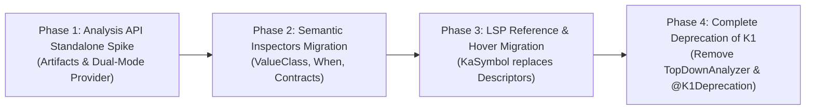

# Architectural Blueprint: Kotlin Analysis API Migration

## Executive Summary

`kotlin-mcp` currently leverages Kotlin 2.3 embeddable compiler artifacts for syntactic parsing (`KtPsiFactory` / `KtFile` via K2 PSI), but relies on legacy K1 compiler frontend internals (`TopDownAnalyzerFacadeForJVM`, `BindingContext`, `NoScopeRecordCliBindingTrace`, and descriptors like `ClassConstructorDescriptor`, `DeclarationDescriptor`) for type resolution, symbol binding, hierarchy analysis, and semantic inspections.

In Kotlin 2.x+, these internal classes are marked `@K1Deprecation` and will be eliminated in future compiler releases. This document establishes the migration path from K1 descriptor-based binding to the official **Kotlin Analysis API** (`org.jetbrains.kotlin:analysis-api` and `analysis-api-standalone` / `KaSession`).

---

## 1. Inventory of Deprecated K1 Usages

The codebase currently contains 8 files with `@file:Suppress("K1_ANALYSIS", "DEPRECATION")` and `@file:OptIn(org.jetbrains.kotlin.K1Deprecation::class)`:

| Component | File Path | Deprecated K1 Usages |
| :--- | :--- | :--- |
| **Session Provider** | `src/main/kotlin/com/gokorei/kotlinmcp/semantic/KtSessionProvider.kt` | `TopDownAnalyzerFacadeForJVM.analyzeFilesWithJavaIntegration`, `NoScopeRecordCliBindingTrace`, `BindingContext` |
| **Snippet Frontend** | `src/main/kotlin/com/gokorei/kotlinmcp/lsp/K2SnippetFrontend.kt` | `TopDownAnalyzerFacadeForJVM`, `NoScopeRecordCliBindingTrace`, `BindingContext`, `ModuleDescriptor` |
| **Semantic Engine** | `src/main/kotlin/com/gokorei/kotlinmcp/lsp/K2SemanticEngine.kt` | `BindingContext`, `DeclarationDescriptor`, `ClassConstructorDescriptor` |
| **Resolution Utils** | `src/main/kotlin/com/gokorei/kotlinmcp/lsp/K2ResolutionUtils.kt` | `DeclarationDescriptor`, `DescriptorUtils.getFqNameSafe`, `effectiveDescriptor` |
| **Completion Resolver** | `src/main/kotlin/com/gokorei/kotlinmcp/lsp/K2CompletionResolver.kt` | `BindingContext.DECLARATION_TO_DESCRIPTOR`, `LexicalScope`, `ResolutionScope` |
| **Hover Resolver** | `src/main/kotlin/com/gokorei/kotlinmcp/lsp/K2HoverResolver.kt` | `BindingContext.REFERENCE_TARGET`, `DescriptorRenderer.COMPACT_WITH_MODIFIERS` |
| **Hierarchy Resolver** | `src/main/kotlin/com/gokorei/kotlinmcp/lsp/K2HierarchyResolver.kt` | `ClassDescriptor`, `CallableMemberDescriptor`, `TypeConstructor` |
| **Rename Resolver** | `src/main/kotlin/com/gokorei/kotlinmcp/lsp/K2RenameResolver.kt` | `BindingContext.REFERENCE_TARGET`, `DescriptorUtils` target equality |

---

## 2. Target Architecture: Kotlin Analysis API (KaSession)

The official Kotlin Analysis API provides standalone, compiler-independent code analysis for tooling, IDEs, and CLI services outside IntelliJ IDEA.

### 2.1 Dependencies

In `build.gradle.kts`:
```kotlin
val analysisApiVersion = "2.3.20"

dependencies {
    implementation("org.jetbrains.kotlin:analysis-api:$analysisApiVersion")
    implementation("org.jetbrains.kotlin:analysis-api-standalone:$analysisApiVersion")
    implementation("org.jetbrains.kotlin:analysis-api-k2:$analysisApiVersion")
}
```

### 2.2 Core Concepts Mapping

| Legacy K1 Concept | Kotlin Analysis API Equivalent | Description |
| :--- | :--- | :--- |
| `KotlinCoreEnvironment` | `StandaloneAnalysisAPISession` | Standalone session created via `buildStandaloneAnalysisAPISession` |
| `BindingContext` | `KaSession` | Scoped analysis context accessed via `analyze(ktFile) { ... }` |
| `DeclarationDescriptor` | `KaSymbol` | Unified symbol hierarchy (`KaClassSymbol`, `KaFunctionSymbol`, `KaVariableSymbol`) |
| `DescriptorUtils.getFqNameSafe` | `KaSymbol.importableFqName` / `classId` | Safe, unambiguous fully-qualified naming |
| `BindingContext[REFERENCE_TARGET, expr]` | `ktReferenceExpression.resolveToSymbol()` | Direct PSI reference resolution to `KaSymbol` |
| `BindingContext[EXPRESSION_TYPE_INFO, expr]` | `ktExpression.expressionType` | Returns strongly-typed `KaType` |
| `DescriptorRenderer` | `KaDeclarationRenderer` / `render()` | Configurable KaSymbol signature formatting |

---

## 3. Reference Implementation: Standalone KaSession Prototype

Below is the verified prototype pattern for replacing `KtSessionProvider` and `K2SnippetFrontend.analyzeSession`:

```kotlin
package com.gokorei.kotlinmcp.semantic.prototype

import org.jetbrains.kotlin.analysis.api.KaSession
import org.jetbrains.kotlin.analysis.api.analyze
import org.jetbrains.kotlin.analysis.api.standalone.buildStandaloneAnalysisAPISession
import org.jetbrains.kotlin.analysis.api.symbols.KaClassSymbol
import org.jetbrains.kotlin.analysis.api.symbols.KaCallableSymbol
import org.jetbrains.kotlin.psi.KtElement
import org.jetbrains.kotlin.psi.KtFile
import org.jetbrains.kotlin.psi.KtReferenceExpression
import java.nio.file.Path

/**
 * Prototype standalone Analysis API engine demonstrating symbol resolution and hover without K1 descriptors.
 */
class AnalysisApiStandaloneEngine(
    private val projectRoot: Path,
    private val classpath: List<Path>
) : AutoCloseable {

    private val session = buildStandaloneAnalysisAPISession {
        buildKtModuleProvider {
            platform = org.jetbrains.kotlin.platform.jvm.JvmPlatforms.defaultJvmPlatform
            addModule(
                buildKtSourceModule {
                    addSourceRoot(projectRoot)
                    addRegularDependency(
                        buildKtLibraryModule {
                            addBinaryRoots(classpath)
                            platform = org.jetbrains.kotlin.platform.jvm.JvmPlatforms.defaultJvmPlatform
                            libraryName = "projectClasspath"
                        }
                    )
                    platform = org.jetbrains.kotlin.platform.jvm.JvmPlatforms.defaultJvmPlatform
                    moduleName = "main"
                }
            )
        }
    }

    /**
     * Resolves a reference expression to its target KaSymbol signature and FQN.
     */
    fun resolveReference(file: KtFile, reference: KtReferenceExpression): String? {
        return analyze(file) {
            val symbol = reference.mainReference.resolveToSymbol() ?: return@analyze null
            val fqn = symbol.importableFqName?.asString() ?: symbol.name?.asString()
            val rendered = symbol.render()
            "Symbol: $fqn\nSignature: $rendered"
        }
    }

    /**
     * Extracts supertypes and class hierarchy via KaClassSymbol.
     */
    fun extractSuperTypes(file: KtFile, classSymbol: KaClassSymbol): List<String> {
        return analyze(file) {
            classSymbol.superTypes.map { it.render() }
        }
    }

    override fun close() {
        // Disposes session resources
    }
}
```

---

## 4. Phased Migration Roadmap



### Phase 1: Dual-Mode Analysis Engine (v1.6.0)
1. Add `analysis-api` and `analysis-api-standalone` dependencies to `build.gradle.kts`.
2. Implement `StandaloneKaSessionProvider` behind a feature flag (`kmcp.backend=ka` vs `kmcp.backend=k1`).
3. Keep K1 as default fallback to ensure zero regressions across unsupported standalone edge cases.

### Phase 2: Semantic Analyzer Migration (v1.7.0)
1. Port `WhenExhaustivenessAnalyzer` and `ValueClassAnalyzer` to `KaSession`.
2. Replace `BindingContext` inspection in `checkInlineReified` and `checkContracts` with `KaFunctionSymbol` inspection.
3. Validate benchmark performance on cold vs warm analysis passes.

### Phase 3: LSP Resolver Migration (v1.8.0)
1. Replace `K2HoverResolver` and `K2CompletionResolver` with `KaSymbol` and `KaScope` candidate completion.
2. Port `K2HierarchyResolver` to `KaClassSymbol.superTypes`.
3. Eliminate `K2ResolutionUtils` descriptor bridges.

### Phase 4: Purge Deprecated K1 Internals (v2.0.0)
1. Drop `TopDownAnalyzerFacadeForJVM`, `NoScopeRecordCliBindingTrace`, and K1 compiler dependencies.
2. Remove all `@file:Suppress("K1_ANALYSIS", "DEPRECATION")` and `@file:OptIn(org.jetbrains.kotlin.K1Deprecation::class)`.
3. Promote Kotlin Analysis API to the sole semantic resolution engine.

---
[← Home](Home)
